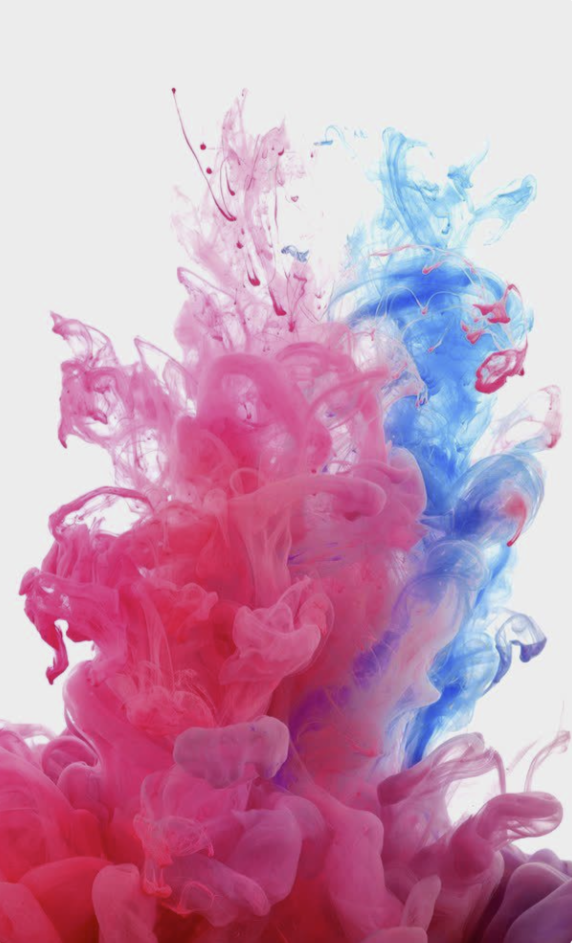
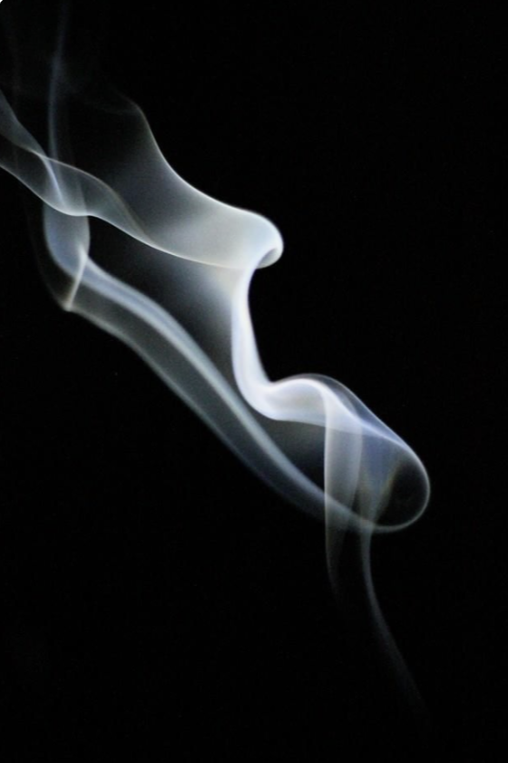
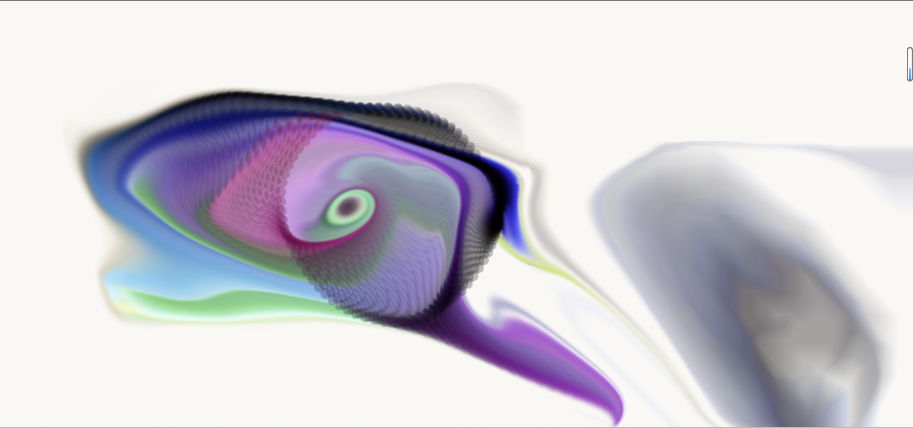

# coding-design-research
## **part1 Imaging Technique** 
## *Images*
artwork1


artwork2

**Inspiration**
#### In this artwork it turn the color become a flow, I also want to create the colorful interactive flow. In my work flow may consist of different element. Here are three aspects i want to learn from this art work


#### 1.Color moves randomly liking smoking.
- I want my work can flow like as smoking which has random moving but could effect by touch.
#### 2.Mouse moving can effect the color. 
- In the reference artwork, When i move across the color, the speed of color accelarate. 
#### 3.Color is changing all the time.
- I hope the the color of the element i created can be change 


## **part2 Coding Technique Exploration** 

## *The Link*
  [the link for coding](https://openprocessing.org/sketch/2152011)
  ## *Images*
coding Image



#### The code segment utilizes the p5.js library.


#### Flow effect, color variation, and mouse interaction:

```
The draw() function acts as the main drawing function, called every frame. Its primary role is to update and draw two layers, which are then rendered onto the main canvas.

One of these layers is dedicated to rendering the flow effect. Within this layer, the flow effect is drawn, featuring a gradually scaling flow pattern and a brush effect influenced by mouse movement.

The main drawing layer is responsible for rendering the faucet effect, utilizing the content of the flow effect layer to update pixels.
```

#### Graphics presentation:

```
The createCanvas() function is invoked with the WEBGL parameter, indicating the use of WebGL for rendering. The code includes shader operations for image processing and utilizes framebuffers to create and manipulate image effects. These operations are executed more efficiently within the WebGL context, leveraging the parallel computing capabilities of the GPU.
```

